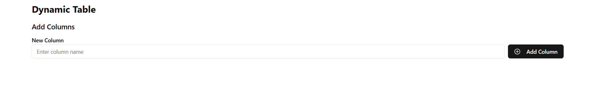
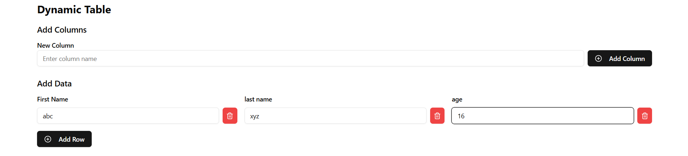
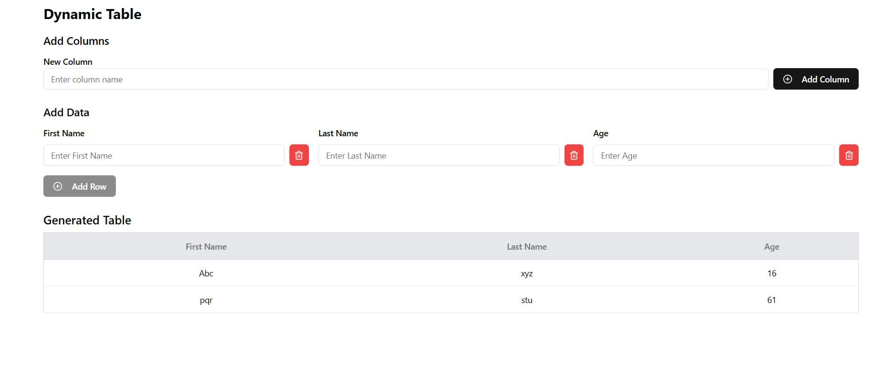

---
# [Developer @EhsaasChaudhary ](https://github.com/EhsaasChaudhary)

---

# Task Description

### Create dynamic table based on array values it will automatic create table for that.

---

# Demo and Screenshots :movie_camera:

## View live preview [here](https://ec-dynamic-table.vercel.app).


---

# Sections :bookmark:

- Add columns


- Add Data 


- Data table 


---

# How to run on local:

### You will first need to clone the project from Github into your local system


## <br />

# Getting Started :dart:

### Step 1:
Install node_module using 
```bash
npm install
```

### Step 2:
run the development server:

```bash
npm run dev
```
Its better to use build server instead of dev server:
```bash
npm run build
then
npm start
```

Open [http://localhost:3000](http://localhost:3000) with your browser to see the result.

---

# Usage :joystick:
## To Add colums
Enter colums name you want to add in and click "Add Columns" to add that colums. You can add multiple columns one after another 

## To Add Data
Enter data you want to add in and click "Add Row" to add that data. You can add data to multiple columns at once
